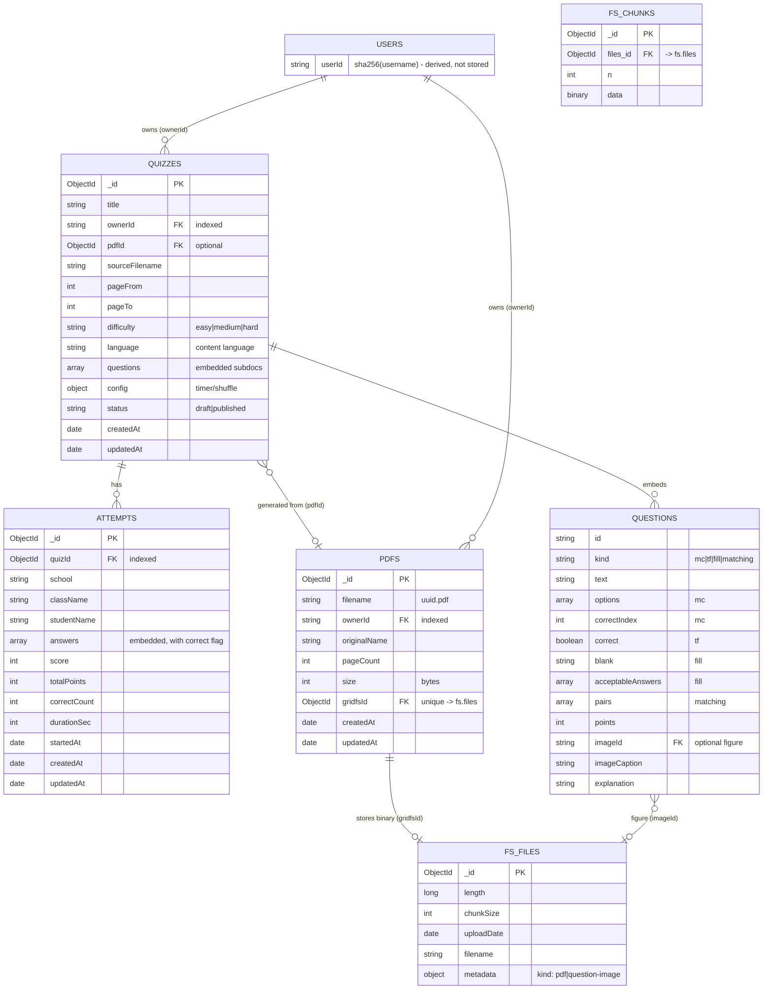

# Database structure

QuizForge uses **MongoDB** (via Mongoose) with **GridFS** for the binary
PDFs and figure images. There are three application collections
(`quizzes`, `pdfs`, `attempts`) plus the two GridFS collections
(`fs.files`, `fs.chunks`).

## Logical diagram (Mermaid)

## Collections

### `quizzes`

One document per quiz. The questions and configuration are **embedded**
subdocuments (a single document read carries the whole quiz, which is what
the student flow needs).

| Field         | Type          | Notes                                              |
| ------------- | ------------- | -------------------------------------------------- |
| `_id`         | ObjectId      | Primary key                                        |
| `title`       | string        |                                                    |
| `ownerId`     | string        | sha256 of the teacher username; **indexed**        |
| `pdfId`       | ObjectId      | Reference to `pdfs._id` (optional)                 |
| `sourceFilename` | string    | Original uploaded PDF name                         |
| `pageFrom` / `pageTo` | int  | Page range used for generation                     |
| `difficulty`  | enum          | `easy` \| `medium` \| `hard`                       |
| `language`    | string        | Language the AI detected in the book               |
| `questions`   | array         | Embedded question subdocuments (see below)         |
| `config`      | object        | `{ timerMinutes, shuffleQuestions, shuffleOptions }` |
| `status`      | enum          | `draft` \| `published`                             |
| `createdAt` / `updatedAt` | date | Mongoose timestamps                            |

Each entry in `questions` carries `id`, `kind`, `text`, `points`,
`explanation`, and then kind-specific fields:

| `kind`      | Extra fields                                          |
| ----------- | ----------------------------------------------------- |
| `mc`        | `options[]` (exactly 4), `correctIndex`               |
| `tf`        | `correct` (boolean)                                   |
| `fill`      | `blank`, `acceptableAnswers[]`                        |
| `matching`  | `pairs[]` of `{ left, right }`                        |
| any         | `imageId` (optional, → `fs.files`), `imageCaption`    |

### `pdfs`

Metadata for each uploaded PDF. The actual bytes live in GridFS; `gridfsId`
links them.

| Field          | Type      | Notes                                       |
| -------------- | --------- | ------------------------------------------- |
| `_id`          | ObjectId  | Primary key                                 |
| `filename`     | string    | `<uuid>.pdf`                                |
| `ownerId`      | string    | sha256 of the teacher username; **indexed** |
| `originalName` | string    | Name of the uploaded file                   |
| `pageCount`    | int       | Used for range validation                   |
| `size`         | int       | Bytes                                       |
| `gridfsId`     | ObjectId  | **unique** → `fs.files._id`                 |
| `createdAt` / `updatedAt` | date | Mongoose timestamps              |

### `attempts`

One document per student submission. Students are **anonymous** — they are
identified only by the free-text `school` / `className` / `studentName`.

| Field            | Type      | Notes                                              |
| ---------------- | --------- | -------------------------------------------------- |
| `_id`            | ObjectId  | Primary key                                        |
| `quizId`         | ObjectId  | → `quizzes._id`; **indexed**                       |
| `school` / `className` / `studentName` | string | Student identity                     |
| `answers`        | array     | Embedded answer subdocuments + a `correct` flag    |
| `score` / `totalPoints` / `correctCount` | int | Graded result                         |
| `durationSec`    | int       | Time taken                                          |
| `startedAt`      | date      | When the student began                             |
| `createdAt` / `updatedAt` | date | Mongoose timestamps                          |

The compound index
`{ quizId: 1, school: 1, className: 1, studentName: 1 }` backs the
"best attempt per student" aggregation.

### GridFS: `fs.files` / `fs.chunks`

MongoDB's default `fs` bucket stores the binary payloads in 255 KB chunks:

| Collection | Contents |
| ---------- | -------- |
| `fs.files` | File metadata: `_id`, `length`, `chunkSize`, `uploadDate`, `filename`, `metadata` |
| `fs.chunks` | Binary data split into chunks: `files_id` → `fs.files._id`, `n` (chunk index), `data` |

Two kinds of blobs are stored, distinguished by `metadata.kind`:

- `"pdf"` — the uploaded textbook (`metadata.originalName`), linked from `pdfs.gridfsId`
- `"question-image"` — cropped figures embedded in questions (`metadata.contentType`), linked from `questions[].imageId`

## Relationships & integrity

- **1 PDF → N quizzes** (`quizzes.pdfId` → `pdfs._id`): one upload can back
  several quizzes. Deleting a PDF is not currently cascaded.
- **1 quiz → N attempts** (`attempts.quizId` → `quizzes._id`): many students
  submit; their best attempt is used for per-question stats.
- **1 owner → N quizzes/pdf** (`ownerId`): a single teacher per env today;
  the field exists so multi-account support can be added later.
- **questions[] and answers[] are embedded** — there are no separate
  question or answer collections.

## Design notes

- **Referential integrity is by convention, not enforced.** `pdfId`,
  `gridfsId`, `imageId` and `quizId` are not `$ref`-validated; orphaned
  references (e.g. after a deleted PDF) simply render as missing images.
- **No users collection yet.** The `ownerId` is the sha256 of
  `TEACHER_USERNAME`, derived in `src/lib/auth.ts`. Legacy documents
  without an `ownerId` are adopted by the first teacher on login
  (`src/lib/ownership.ts`).
- The dashboard list sorts by `updatedAt`; adding an index on
  `{ ownerId: 1, updatedAt: -1 }` would be the natural next step at scale.
